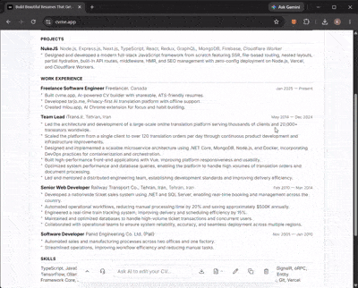
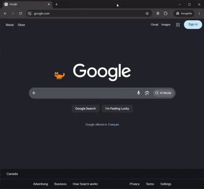
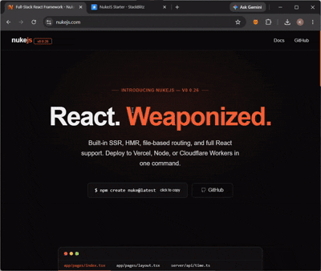

# Kaveh Taheri   

**Software Engineer · Full-Stack Developer · AI & Open Source**

[hi@kav3.com](mailto:hi@kav3.com) · [kav3.com](https://kav3.com)

I build web applications, developer tools, frameworks, and AI-powered products.

## 🤹 Skills

* 👌 **Languages:** **TypeScript**, **JavaScript**, C#
* ⚡ **Frontend:** React, **Next.js**, **Vue**, **Nuxt**, Blazor
* 🧠 **Backend:** **Node.js**, NestJS, .NET Core
* 🗄️ **Data:** SQL Server, **MongoDB**, EF, Prisma
* 🔌 **APIs & Architecture:** Socket.IO, **WebSocket**, **oRPC**, CQRS
* 🛠️ **Tools & Infrastructure:** Git, **esBuild**, Tailwind CSS, Docker, Portainer, Kubernetes

## 🚀 Latest Projects

### 📄 [cvme.app](https://cvme.app)

**Build beautiful resumes that get more interviews.**

Create ATS-friendly resumes with AI, practice with mock interviews, and share your resume anywhere, all in minutes.

### 😻 [Miou](https://miou.app)

**A cat with a brain, not a cloud.**

A private AI companion that thinks, learns, and grows with you. Built around local AI and designed to keep your data on your device.

### ☢️ [NukeJS](https://nukejs.com)

**React. Weaponized.**

A full-stack React framework with SSR, HMR, file-based routing, and full React support out of the box. Deploy to Vercel or Node in one command.

### ❤️ Support NukeJS
If you find **NukeJS** useful, consider giving it a ⭐ on GitHub. It helps the project get more visibility and motivates me to keep building and improving it.
⭐ [Star NukeJS on GitHub](https://github.com/nuke-js/nukejs)

### ✈️ [Kav3](https://kav3.com)

My personal portfolio, projects, experiments, and everything else I build.

### 🧠 [Amnesia](https://chromewebstore.google.com/detail/amnesia/ggjmkkkkdkkbjdmkiolbpdmhdckbdbha)

A Chrome extension that temporarily forgets distracting websites to help you stay focused.

### ☀️ [NoonJS](https://noonjs.com)

**A no-code backend framework for MongoDB.**

Generate a secure MongoDB CRUD API with authentication, permissions, and real-time Socket.IO events using a simple configuration file.

---

  Building things, breaking things, and occasionally making them work.

